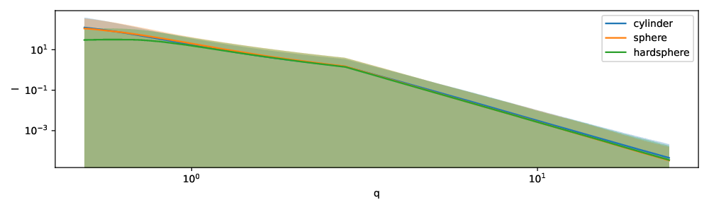
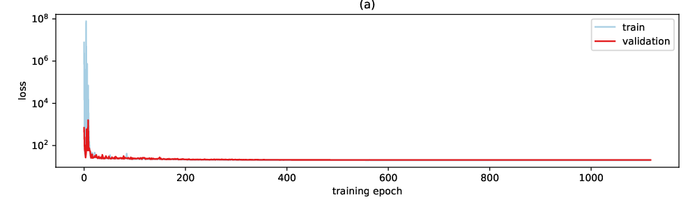
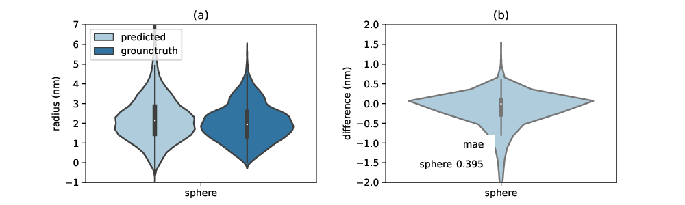
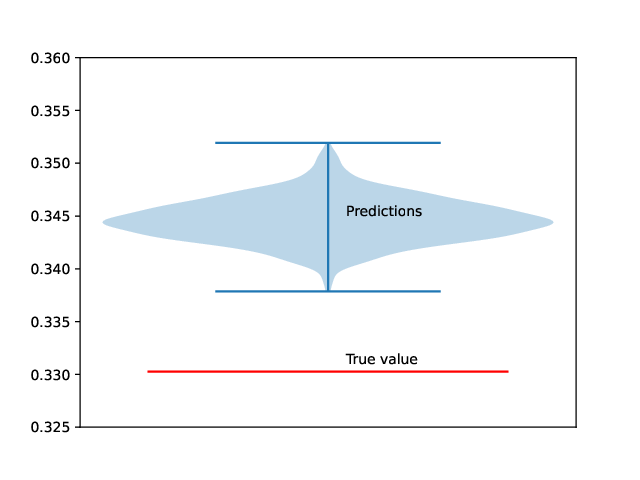

# Determining Size and Shape Parameters from Small-Angle Scattering Data using Invertible Neural Networks

Sofya Laskina, Brian R. Pauw, and Philipp Benner
: Federal Institute for Materials Research and Testing (BAM), Unter den
Eichen 87, 12205 Berlin, Germany
: philipp.benner@bam.de, brian.pauw@bam.de

Abstract
========

Scattering techniques, such as small-angle X-ray or neutron scattering,
provide information on the fine structure of materials by measuring the
intensity of waves scattered via an interference process.

While this interference process can be accurately described in
mathematics as a Fourier transform of the probed electron density, not
all the information contained therein is recorded in the measurement
process. The information loss is of such a magnitude that the retrieval
of practically-relevant structural information falls under the class of
inverse problems.

For analyzing single datasets, a bespoken model can usually be
constructed. For processing larger quantities of data, however, such as
collected at well-functioning laboratory instruments or large
facilities, an initial clustering and indication of the class and size
of scatterers involved would already be a good step forwards. A
reliable, universal clustering method does not exist as yet.

We attempt to address this problem using invertible neural networks
trained on theoretical scatterers with their analytical SAS intensities.
Somewhat surprisingly, our method is able to reliably identify size and
shape parameters. This shows that invertible neural networks may have
large potential to help interpret small-angle scattering measurements.
Ideally, we hope that this work is a first step towards a fully
automated SAS data processing workflow.

Software: [https://github.com/pbenner/ixs](https://github.com/pbenner/ixs)

Introduction
============

Since its inception in the very beginning of the 20th century,
small-angle scattering methods have provided some insight into the fine
structure of materials, elucidating structures with dimensions including
(and occasionally exceeding) 1-100 nm. While the experiments are
straightforward, the data correction and analysis is not. With
increasing amounts of data flowing from the instruments, an urgent need
arises for the development of automatable analysis solutions.

Analysis of small-angle scattering patterns has evolved in great strides
over the last century. Initially, only generic, unreliable information
could be deduced from linearization of unreliably recorded scattering
intensity (a notable example where both the data as well as the analysis
method was unreliable). With the increasing availability of computing
power, least-squares minimization methods could become mainstream,
although they still rely on models that can be parameterized using only
a handful of free parameters. More advanced analyses nowadays no longer
require the distribution form to be defined, but return a parameter
(typically size-) distribution when a scatterer shape is defined.
Whether or not both size distribution parameters as well as shape
classes can be determined remains an open question. Even an initial
guess, however, would be helpful in tackling the vast amounts of data
currently collected in laboratories and large facilities worldwide.

Invertible neural networks (INNs) [@ardizzone2018] [@behrmann2019][1] are a
promising alternative to existing methods for estimating material
characterstics from SAS measurements. These methods specifically address
surjective problems, where the measurement data is not sufficient for
recovering all information about a sample. *As opposed to traditional
methods, where this gap is filled with prior assumptions, INNs learn
this information entirely from training data.* This makes INNs ideal for
applications where prior information is difficult to be expressed in
mathematical terms, however, at the cost of having to collect a
sufficiently large set of training data, which is representative for the
experimental setup at hand. In addition, INNs are probabilistic models
and their invaluable strength is that they allow to recover a full
distribution of feasible solutions. Other machine learning models have
been applied to SAS data [@tomaszewski2021; @scherdel2021; @roding2022],
but they do not address the surjective nature of the inverse problem.

In this study, we consider small-angle scattering data of isotropically
scattering, size-disperse systems. We create a large data set of
simulated theoretical scatterers with varying shapes and sized and their
corresponding intensity curves. This data is used to train our INN (i.e.
estimate the parameters of the model) and we show that our model is
capable of recovering size and shape parameters of the theoretical
scatterers with high precision. In addition, we provide a software
package of our model that can be easily applied to
other data sets. This allows researchers to train models that are
capable of predicting size and shape parameters for their domain of
interest, given that a sufficiently large data set of simulated or
experimental SAS measurements with known parameters is available.

Results
=======

Synthetic data
--------------

The synthetic data is generated by drawing size and shape parameters at
random. For each sampled set of parameters, the one-dimensional
scattering curve is computed using an analytical solution implemented in
SasView. We set the size of the simulation box in real space to
$l = 100~nm$. The one-dimensional intensity is computed for $n$
scattering angles $q = \log(0.03), \dots, \log(3)$ (evenly spaced on
log-scale). In all simulations, the scattering length density (SLD) is
set to one for the scatterer and zero for the solvent. We decided to
restrict the data set to three shapes, namely, spheres, hardspheres, and
cylinders. For each of the shapes, we created 5000 samples.

##### &nbsp; {#tab:1}

|                       |cylinder                  |sphere                    |hard sphere               |
|-----------------------|--------------------------|--------------------------|--------------------------|
|radius                 |$\mathcal{N}(2, 1)$       |$\mathcal{N}(2, 1)$       |$\mathcal{N}(2, 1)$       |
|radius polydispersity  |$\mathcal{N}(0.1, 0.03)$  |$\mathcal{N}(0.1, 0.03)$  |$\mathcal{N}(0.1, 0.03)$  |
|length                 |$\mathcal{N}(10, 5)$      |---                       |---                       |
|length polydispersity  |$\mathcal{N}(0.1, 0.03)$  |---                       |---                       |
|volume fraction        |$\mathcal{N}(0.2, 0.01)$  |$\mathcal{N}(0.2, 0.01)$  |$\mathcal{N}(0.2, 0.01)$  |

**Table 1**: Distributions of parameters for generating synthetic data. The normal distributions $\mathcal{N}(\mu, \sigma)$ are parameterized by their mean $\mu$ and standard deviation $\sigma$.

The parameters for generating the synthetic data are given in
Table [1](#tab:1). For all three
shapes we have as parameters the *radius* and the *radius
polydispersity*. Both parameters are assumed to follow a Gaussian
distribution. While the distribution of the radius defines the variation
between samples, the polydispersity introduces variation of the radius
within a sample. The hard sphere and cylinder have additional
parameters. For hard spheres we set the *effective radius*, which
represents the interaction radius of a particle, equal to the actual
radius. For instance, due to charges the effective radius might be
greater than the actual radius of the particle. Many such interactions
exist that can adjust the effective radius compared to the real radius.
The *volume fraction* parameter regulates how densely the simulation box
is filled. It is drawn with equal probability from a set of 7 values
(see Table [1](#tab:1)). For the
cylinders, the angular parameters are not specified, because they are
not captured by one-dimensional scattering curves. Finally, we applied
some noise to the simulations. The simulated intensity is multiplied at
each scattering angle $q$ by a random value drawn from a normal
distribution with mean $\mu = 1$ and standard deviation $\sigma = 0.1$,
which we selected because the resulting scattering intensities closely
resemble experimental ones. The mean and 95% quantile of the simulated
data is shown in Figure [1](#fig1).

#### &nbsp; {#fig1}

**Figure 1**: Mean and 95% quantile of synthetic intensity curves stratified by shape

Prediction of size and shape parameters
---------------------------------------

In our approach, we specifically want to address the surjectivity of the
inverse scattering problem. There exist several machine learning models
that are designed for inverse problems, the most important, among
others, are i-ResNet [@behrmann2019] and conditional RNVP
[@ardizzone2018]. The i-ResNet approach puts constraints on the Jacobian
of the neural network model, thereby allowing the computation of the
inverse through simple fixed point iterations. The disadvantage of this
approach is on the one hand the computational cost and on the other hand
a lack of uncertainty quantification. Conditional RNVPs are more
appropriate for SAS data, because they belong to the family of
generative models and therefore allow to compute multiple inverse
solutions that can be aggregated into a mean prediction and an
uncertainty measure such as the standard deviation. A full description
of the model and our modifications is provided in Section
[4](#sec:methods). Our software package relies on the implementation of an existing RNVP model
[@freia].

To evaluate our model on the synthetic SAS data, we randomly divided the
data into train (90%) and test (10%) data. On the training data, we
estimated model parameters using *adaptive momentum estimation* (Adam)
and a plateau scheduler to automatically reduce the learning rate (see
Section [4](#sec:methods)) when
needed. A small fraction (10%) of the training data is set apart as
validation set to stop training before the model starts overfitting.
Figure [2](#fig2) shows that the
training is converging well and that we observe almost no overfitting on
the validation data. The test data is then used to evaluate the accuracy
of predictions.

#### &nbsp; {#fig2}

**Figure 2**: raining and validation loss as a function of epoch during estimation of model parameters

#### &nbsp; {#fig3}

**Figure 3**: Prediction accuracy of radii. (a) Distributions of predicted and groundtruth radii (b) Distribution of differences between predicted and true radii. The mean absolute error (mae) is shown as table within the figure

Uncertainty quantification
--------------------------

#### &nbsp; {#fig4}

**Figure 4**: Uncertainty quantification of radius predictions for a cylinder sample. The uncertainty of the model is estimated by repeatedly computing radius predictions for a fixed cylinder scattering curve.

Methods {#sec:methods}
=======

Machine learning model
----------------------

An invertible neural network (INN) is a bijective function $f(x) = y$,
i.e. there exists an inverse $g = f^{-1}$ such that $x = (g \circ f)(x)$
for all $x$. INN models typically consist of smaller invertible building
blocks, also called *coupling blocks*. Several invertible coupling
blocks have been proposed so far. We rely on the RealNVP (RNVP) coupling
block [@dinh2016] as defined by $$\begin{aligned}
    y_1 &= x_1 \odot \exp\left[ s_2(x_2)\right] + t_2(x_2)\\
    y_2 &= x_2 \odot \exp\left[ s_1(y_1)\right] + t_1(y_1)\end{aligned}$$
where $\odot$ is the element-wise multiplication. Input and output are
split into two halves $$x = [x_1, x_2]\,,\quad y = [y_1, y_2]\,.$$ and
the functions $t_1, t_2, s_1, s_2$ can be chosen arbitrarily, but
typically consist of dense neural networks. The splitting of the input
allows to easily compute the inverse. When building INN models, it is
important to shuffle the inputs to increase the expressiveness of the
model.

For surjective problems, the output $y$ contains less information than
the input $x$ of the INN model. Conditional RNVPs circumvent this
problem by using an augmented output $\tilde{y} = [y, z] = f(x)$, where
$z$ is a latent representation of the lost information that is learned
during model training [@ardizzone2018]. The inverse of an output $y$ is
computed by first randomly drawing a value $z$ and then computing the
inverse $x = g([y, z])$. Multiple solutions $x$ can be computed by
repeating this process, which then allows to provide summary statistics,
such as mean and variance.

Architecture
------------

Training
--------

Acknowledgments
===============

This work benefited from the use of the SasView application, originally
developed under NSF award DMR-0520547. SasView contains code developed
with funding from the European Union's Horizon 2020 research and
innovation programme under the SINE2020 project, grant agreement No
654000.

References
==========

[1] Jens Behrmann, Will Grathwohl, Ricky TQ Chen, David Duvenaud, and Jörn-Henrik Jacobsen. *Invertible residual networks. In International Conference on Machine Learning*, pages 573–582. PMLR, 2019.
